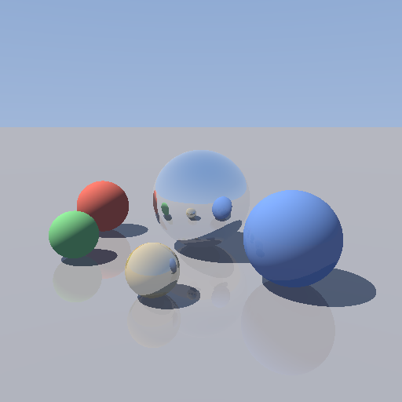

# Bend Ray Tracer

An interactive ray tracer written entirely in [Bend](https://bend-lang.com).
The renderer, the window, the input handling and the proofs are all Bend —
there is no C, no CUDA, no Metal and no Python viewer.

Drag with the mouse to orbit the camera. The frame renders at 128×128 while
the button is down and at 512×512 when you let go.



## Run it

```sh
./run.sh
```

That checks the toolchain, proves the four laws, builds the binaries and opens
the viewer. Other entry points:

| command | what it does |
| --- | --- |
| `./run.sh doctor` | report the toolchain and stop |
| `./run.sh proof` | run the proof gate (`bend PROOF.bend`) |
| `./run.sh build` | build `./rtracer` and `./bench` |
| `./run.sh bench` | time the renderer on 1 core, all cores, and the GPU |

**Controls** — drag to orbit · `Up`/`Down` to zoom · `Esc` or the close box to quit.

### Requirements

* Bend 2.0.5
* clang 19 or newer (19+ is what the `!` GPU calls need)
* For the GPU: CUDA on Linux, or Metal on macOS. `bend` looks in `$CUDA_HOME`
  and then `/usr/local/cuda`; `run.sh` finds a distro install (such as Arch's
  `/opt/cuda`) and exports `CUDA_HOME` for you.
* `libx11-dev` for the window.

Without a GPU everything still builds and runs — Bend executes `!` calls in
parallel on the CPU instead.

## The scene

A ground plane and five spheres under one directional light with hard shadows:
a mirror (0.88 reflective), a glossy gold sphere (0.5), a faintly reflective
blue one, and matte red and green ones. The floor is 0.16 reflective, which is
what gives the soft doubling under each sphere. Reflections recurse to a fixed
depth of 3.

No textures, no path tracing and no BVH — the scene is six objects tested
exhaustively per ray.

## How it is parallelised

Bend's `Image` is a quadtree: `Pix{colour}` paints a square and
`Qua{tl,tr,bl,br}` splits one in four. That is exactly the recursive split the
renderer wants, so `Render.tile` divides the frame into quadrants down to
single pixels and issues the four children as one parallel call:

```python
tl tr bl br = Render.tile(p, h, x, y, bs)
  Render.tile(p, h, (x + h : U32), y, bs)
  Render.tile(p, h, x, (y + h : U32), bs)
  Render.tile(p, h, (x + h : U32), (y + h : U32), bs)
```

The split is balanced by construction — every quadrant is the same size and
every leaf costs one primary ray — which is what Bend's fork-join scheduler
needs, since it hands each task to a core once and never moves it.

`Render.at` issues the whole tree with `Render.tile!(...)`, and the `!` sends
that call and every parallel call inside it to the GPU. Window handling and
input stay on the CPU, in `main.bend`.

Two details worth knowing:

* **Frames are powers of two.** The window picks `k` with `2^k ≥ max(w,h)` and
  indexes the quadtree by the bits of x and y, so a square power-of-two frame
  maps to the tree exactly. A 640×480 window would mean building a 1024×1024
  tree and showing a corner of it — 3.4× wasted work, or an unbalanced tree if
  you prune. 512×512 and 128×128 avoid the problem entirely.
* **Low resolution is free.** A `Pix` reached before level `k` fills its whole
  subsquare, so the 128×128 drag frame is simply a tree that stops two levels
  early, and the window scales it up. There is no separate downscale path.

The frame is cached in the app state and only re-rendered when an event moves
the camera; `App.run` calls `view` at 60 Hz, and re-tracing an unchanged scene
every frame would keep the GPU busy for nothing.

## Benchmarks

RTX 4070 Ti, 32-thread CPU, three reflection bounces, µs per frame:

| frame | `--gpu off --threads 1` | `--gpu off` (32 threads) | GPU (default) |
| --- | ---: | ---: | ---: |
| 128×128 (drag) | 1 995 | **515** | 940 |
| 512×512 (full) | 28 433 | **3 016** | 5 116 |
| 1024×1024 | 112 600 | **10 800** | 19 150 |

Reproduce with `./run.sh bench`; run-to-run variation is around 10%, most of
it on the GPU row. All three configurations produce identical frame checksums,
which is a decent end-to-end check that the CPU and GPU lanes agree.

The 32-core CPU beats the GPU here by about 1.7×, and the gap is stable across
frame sizes. That matches what `bend guide` says to expect: the GPU wins on
uniform numeric work and loses on divergent work, and a ray tracer is
divergent — a ray that hits nothing returns the sky immediately while its
neighbour runs three bounces and three shadow rays. Scaling from 1 to 32
threads gives 10.4× at 1024×1024, so the quadtree split itself parallelises
well; it is the per-lane divergence that costs the GPU.

## The laws

`LAWS.bend` states four properties and `PROOF.bend` proves them.
`bend PROOF.bend` (or `./run.sh proof`) is the gate — it prints
`All terms check.` only when all four hold.

| law | what it says |
| --- | --- |
| `frame_pixels` | a frame rendered at depth `d` has exactly `4^d` pixels — `Img.count` only counts a tree exactly `d` levels deep, so the renderer never stops early or splits too far |
| `channel_bounded` | every colour channel is ≤ 255, for **any** float — including the infinities and NaNs a degenerate ray can produce |
| `pitch_in_range` | after any drag, any distance, either direction, the camera's pitch is still within ±89°, so it can never flip |
| `bounce_depth` | from any hit and any ray, the reflection recursion returns within `MAX_DEPTH` bounces |

All four are about structure and integer bounds, never float precision. That
is forced: Bend's `F32` operations are declared as `law F32.add` and friends,
open claims with no computational content, so no proof can see inside a float.

The design follows from that. The camera's pitch is stored in **tenths of a
degree as a `U32`** (0…1780, decoding to −89.0…+89.0) rather than as a float,
and the colour clamp is redone over `U32` after the float clamp, so both bounds
live where they can be established. Neither costs anything: `U32.cmp` compiles
to a single native comparison.

The recurring trick is that a `match` on a `Bool` or `Cmp` does not tell the
checker which way the test went, so the lemma carries the comparison's result
as an equation and case-splits on that:

```python
law cap_go_ok:
  for +n: U32
  for c: Cmp
  for h: {U32.cmp(n, R.Color.MAX()) == c : Cmp}
  {U32.is_le(R.Color.cap.go(c, n), R.Color.MAX()) == True{} : Bool}
```

`bounce_depth` is stated over `Trace.depth`, which counts the bounces `Trace`
takes on the same inputs. A function returning a colour gives a proof nothing
to measure, so the count is a separate def — but the two share their
ray-generation defs (`Trace.org`, `Trace.dir`), so they step in lockstep and
the law bounds the renderer rather than a copy of it.

Each law was checked against a deliberate break — uncapping the colour clamp,
replacing a quadrant with a constant `Pix`, uncapping the pitch, and counting
two per bounce — and each break fails the gate.

## Layout

| file | |
| --- | --- |
| `vec.bend` | 3D float vectors |
| `scene.bend` | geometry, materials, lighting, and the bounded reflection recursion |
| `render.bend` | camera, colour packing, and the parallel quadtree split |
| `main.bend` | the `App`: window, event fold, frame cache |
| `bench.bend` | headless timing harness |
| `LAWS.bend` | the four claims |
| `PROOF.bend` | their proofs, plus the arithmetic lemmas |
| `run.sh` | toolchain check, proof gate, build, bench, launch |
| `NOTES-BEND.md` | rough edges hit along the way, written up for upstream |
